# Lista de tarefas

Aplicativo de desafio para Keener.

## Get Start

Para compilar este projeto, certifique-se de ter a versão 2.10.0 do Flutter instalado

## Requisitos:
1. Uso do Crashlytics e Analytics como log de eventos e de erros

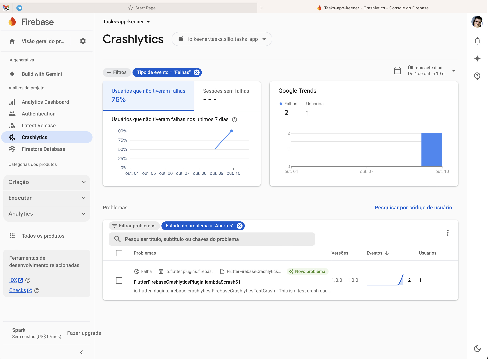

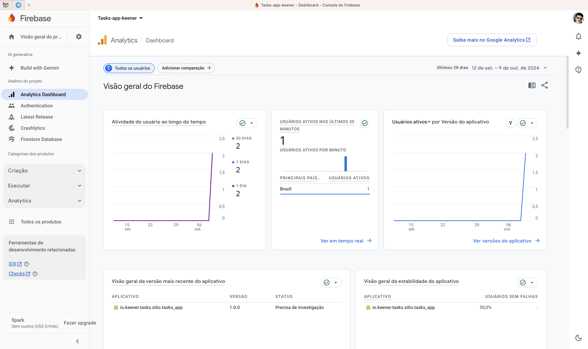

2. Uso do Firebase para autenticação do usuário

3. Uso do Cloud Firestore como banco de dados 

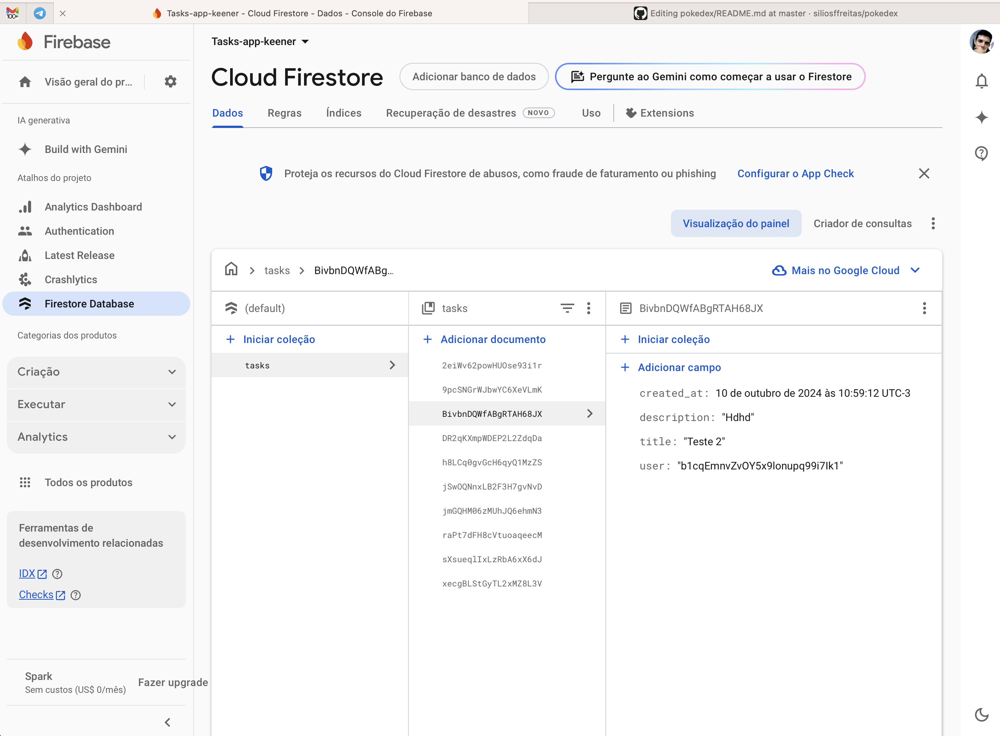

4. O Mobx está sendo utilzado como gerenciador de estado das telas, ele representa a camada de **Presenter**, que será exlicado logo mais na sessão de arquitetura.

5. Uso do Flutter Modular para injeção de dependências (soli**D**). Todas as dependências nas classes são injetadas por quem utiliza-as, facilitando assim a criação dos testes
6. Arquitetura Limpa e princípios do SOLID. A Arquitetura seguida foi a proposta por **Uncle Bob Martin** levemente adaptado. 

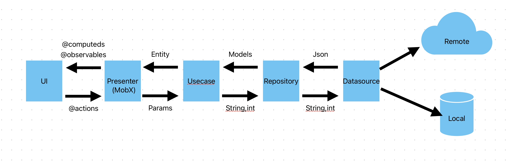

## Preview

Na pasta screenshots existem alguns prints tirados do app rodando e um vídeo com um overview.
### Tela de Login
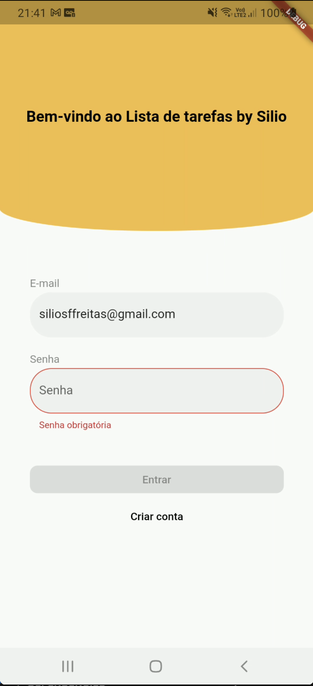

### Tela de Cadastro
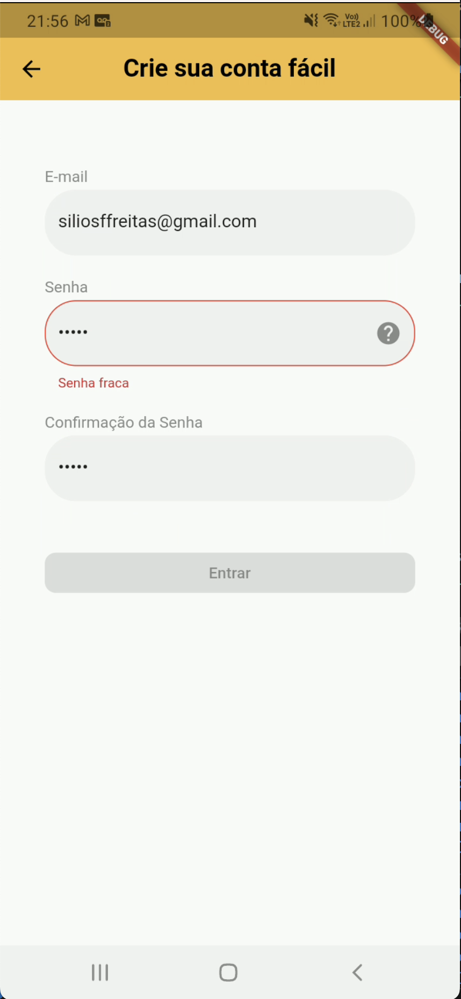

### Tela Home
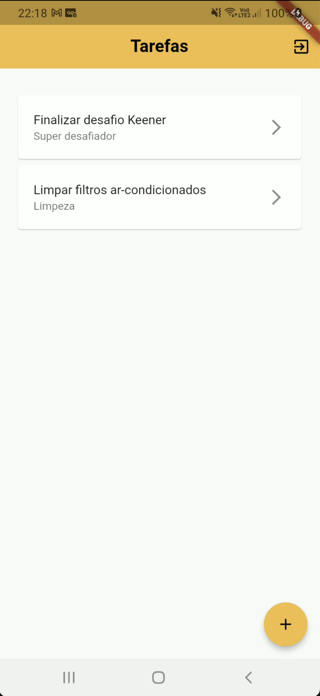

### Nova tarefa
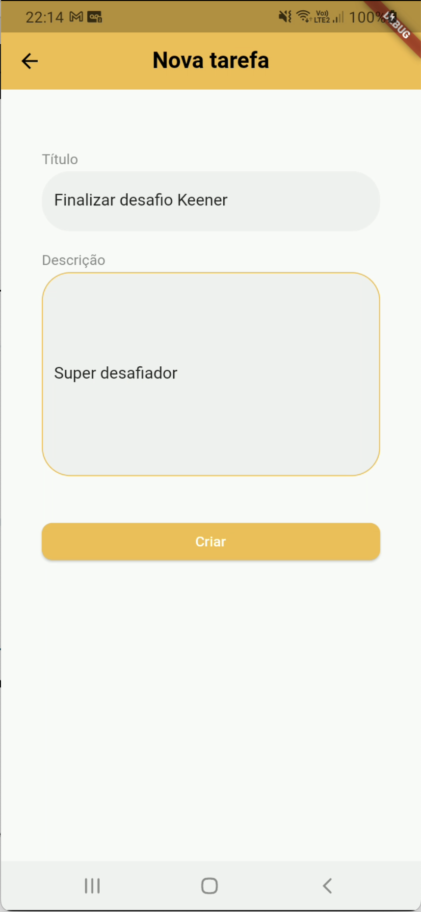

### Detalhes de uma tarefa
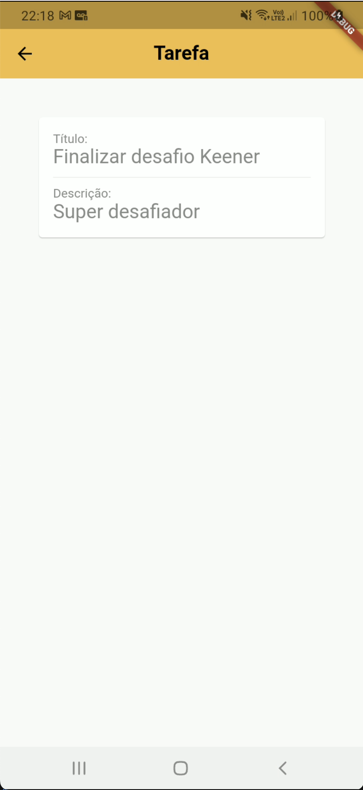

## DEMO
Caso o vídeo não abra diretamente abaixo, você pode visualizar uma demonstração completa na **pasta screenshots, o arquivo demo.mp4** ou cliando <a href="screenshots/demo.mp4">aqui</a>.

<video src="screenshots/demo.mp4" width="400"  controls></video>

## Testes com dispositivos:
O projeto foi testado nos seguintes dispositivos:
- Samsung A20s (Real)
- iPhone 14 (Real)

## Estatíticas a cerca do código
### Cobertura de testes
Apesar de não ter sido um requisito para o projeto, foi implementado também uma bateria de testes contendo **184** testes de unidade e de Widget que juntos cobrem cerca de **95%** do código. Anexo dois prints dos relatórios de cobertura: 
- Com a própria ferramenta do Flutter:

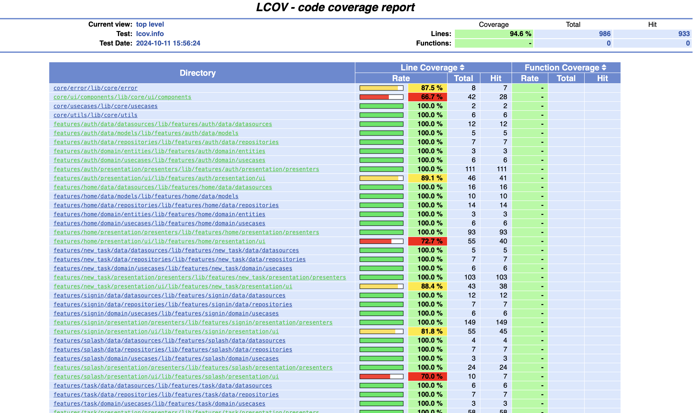

- Com uma extensão do VSCode qu exibe uma visualização da cobertura em árvore:
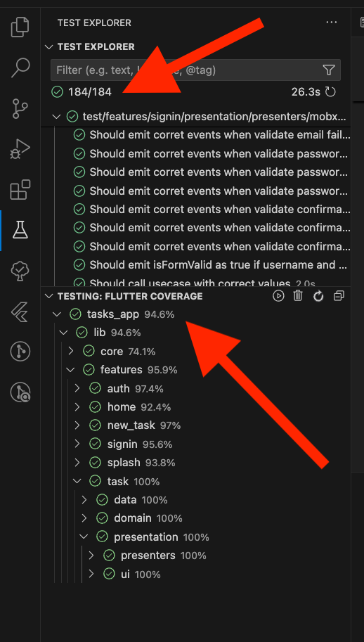

---
**NOTE**

É possível executar os seguintes comandos para reproduzir essa saída fornecida nos prints acima:

`flutter test --coverage`

`genhtml coverage/lcov.info -o coverage/html`

`open coverage/html/index.html`

---